# 📚 weatherwiseplanner - Codebase Documentation

**Repository:** https://github.com/rayklanderman/weatherwiseplanner

**Analysis Date:** Generated by Codebase Genius AI

## 📊 Overview

- **Files Analyzed:** 3
- **Classes:** 9
- **Functions:** 22
- **Code Relationships:** 52

## 📁 File Analysis

### 🔍 `backend\data_fetcher.py`

**AI Analysis:** Here's an analysis of the provided Python code snippet:

1.  **Brief Description:**
    This file, `data_fetcher.py`, is a backend utility responsible for configuring and potentially fetching/processing environmental or weather data. It defines various "condition settings" (e.g., very hot, very cold) with their respective thresholds and variables, and includes logic for transforming raw data (e.g., converting Kelvin to Celsius). It sets up paths for sample NetCDF and mock JSON data, indicating it can work with both real and simulated datasets.

2.  **Key Functions and Their Purposes:**
    *   `_apply_transform(variable: str, values: np.ndarray) -> np.ndarray`: This helper function applies predefined transformations to numerical data arrays. It uses the `VARIABLE_TRANSFORMS` dictionary to find and execute a lambda function based on the input `variable` name (e.g., converting temperature from Kelvin to Celsius).
    *   `_compute_probability(...)` (incomplete in snippet): Based on its name, this function is intended to calculate probabilities, likely related to the defined weather conditions or other statistical analyses on the fetched data.

3.  **Classes and Their Responsibilities:**
    No classes are defined in the provided code snippet. The file primarily uses functions and global configuration dictionaries.

4.  **Important Design Patterns or Architectural Decisions:**
    *   **Configuration-Driven Logic:** The `CONDITION_SETTINGS` and `VARIABLE_TRANSFORMS` dictionaries externalize key operational parameters and data transformations. This makes the system flexible, allowing conditions and transformations to be modified or extended without altering core logic.
    *   **Data Transformation Layer:** The `_apply_transform` function, coupled with `VARIABLE_TRANSFORMS`, establishes a clear and reusable layer for preprocessing raw data (e.g., unit conversions), ensuring consistency across different data uses.
    *   **Optional Dependency Handling:** `xarray` is imported within a `try-except` block, making it an optional dependency. This allows the code to run even if `xarray` is not installed, though functionality relying on it (like NetCDF processing) would be unavailable.
    *   **Centralized Path Management:** Global constants like `ROOT`, `PUBLIC_DIR`, `SAMPLE_NETCDF`, and `MOCK_JSON` define important file system paths, promoting consistency and ease of maintenance for data access.

5.  **Dependencies and Relationships:**
    *   **External Libraries:**
        *   `numpy`: Essential for numerical operations, especially within `_apply_transform` and likely `_compute_probability`.
        *   `pandas`: Used for data manipulation, often with tabular or time-series data.
        *   `xarray` (optional): For handling labeled multi-dimensional arrays, particularly for reading NetCDF (`.nc`) files like `SAMPLE_NETCDF`.
        *   `json`: For working with JSON data, likely for `MOCK_JSON`.
        *   `logging`: For logging events, debugging, and operational insights.
        *   `pathlib.Path`: For object-oriented filesystem path manipulation.
        *   `datetime`: For handling date and time objects.
    *   **Internal Relationships:**
        *   `_apply_transform` directly depends on `VARIABLE_TRANSFORMS`.
        *   The `CONDITION_SETTINGS` define criteria that will likely be applied to data fetched and processed by other (unseen) functions within this module, potentially using the transformed data.
        *   The defined file paths (`SAMPLE_NETCDF`, `MOCK_JSON`) indicate that this module (or related ones) will interact with these files to fetch data.
        *   The module is part of a `backend` system, suggesting it provides processed data or insights to other backend services or a frontend application.

**Classes:**
- `WeatherDataFetcher`

**Functions:**
- `_apply_transform`: Based on the function name `_apply_transform`, this function likely does the following:

This function likely **applies a specified transformation to an input item or data structure.** It probably takes the item to be transformed and the transformation itself (e.g., a function, a set of rules, or a configuration) as arguments, and returns the transformed result. The leading underscore `_` indicates it's an internal helper function, not intended for direct public use.
- `_compute_probability`: This function likely **calculates or determines a probability** based on its input arguments.

It would return a numerical value, typically a float between 0.0 and 1.0, representing the likelihood of a specific event or outcome. The leading underscore `_` suggests it's an internal helper function, not intended for direct external use, but rather called by other functions within the same module or class.
- `_compute_trend`: Based on the function name `_compute_trend`, this function likely:

**Calculates and extracts the underlying long-term direction or pattern (the "trend") from a dataset, most commonly time-series or sequential data.**

It aims to separate this general movement from short-term fluctuations, seasonality, or random noise. The leading underscore `_` suggests it's an internal helper function, not intended for direct external use.
- `_dataset_time_range`: Based on the function name `_dataset_time_range`, this function likely does the following:

This internal helper function (indicated by the leading underscore) likely **calculates or determines the overall time span (earliest and latest timestamps) covered by the data within a specified dataset.** It would return the minimum and maximum timestamp found across all relevant time-based fields in the dataset.
- `__init__`: Based on the function name `__init__` and typical usage patterns in Python, this function likely does the following:

This is a **special method** (often called a "dunder" method) in Python that serves as the **constructor** for a class.

Its primary purpose is to **initialize the attributes (state) of a newly created object (instance)** of that class. It is automatically called right after an object has been created but before it's returned to the caller.

Inside `__init__`, you typically assign initial values to instance variables using `self.attribute_name = value`.
- `_load_mock`: Function _load_mock
- `_ensure_dataset`: Function _ensure_dataset
- `_window_dataset`: Function _window_dataset
- `_build_from_dataset`: Function _build_from_dataset
- `get_payload`: Function get_payload
- `query`: Function query
- `get_fetcher`: Function get_fetcher

**Dependencies:**
- `from __future__ import`
- `import json`
- `import logging`
- `import os`
- `from datetime import`
- `from pathlib import`
- `from typing import`
- `import numpy`
- `import pandas`

### 🔍 `backend\groq_insights.py`

**AI Analysis:** This Python file, `groq_insights.py`, is designed to integrate with the Groq API to generate and format weather insights specifically tailored for farmers. Its primary goal is to leverage Groq's fast inference capabilities to provide sub-second responses, enhancing the user experience for agricultural users. It focuses on translating complex weather data into easily understandable, "farmer-friendly" language.

---

### 1. Brief Description

This file provides the foundational components for interacting with the Groq API to fetch and process weather-related data. It includes a custom error class, default configuration settings for the Groq model, and a crucial utility function to format raw weather condition data into human-readable, farmer-centric descriptions, ensuring clarity and relevance for its target audience.

---

### 2. Key Functions and Their Purposes

*   **`_format_condition_lines(results: Dict[str, Any]) -> str`**:
    *   **Purpose**: This function takes a dictionary of weather condition results (e.g., `very_hot`, `very_cold`) and formats them into a multi-line, human-readable string. It uses predefined "farmer-friendly" labels, incorporates probability percentages, threshold values (with units), and trend information to present the insights clearly. This is central to making the data accessible to farmers.

---

### 3. Classes and Their Responsibilities

*   **`GroqClientError(RuntimeError)`**:
    *   **Responsibility**: This is a custom exception class designed to be raised specifically when an error occurs during an interaction with the Groq API. It provides a more specific error type than a generic `RuntimeError`, allowing for more precise error handling in calling code.

---

### 4. Important Design Patterns or Architectural Decisions

*   **Graceful Degradation/Fallback**: The `try-except ImportError` block for the `groq` library demonstrates a graceful fallback mechanism. If the `groq` package is not installed, the module will not crash immediately but will set `Groq` to `None` and `GroqError` to `Exception`, allowing other parts of the application to potentially handle the missing dependency or operate in a degraded mode.
*   **Configuration via Constants**: `DEFAULT_MODEL` and `DEFAULT_TIMEOUT` are defined as module-level constants, making it easy to configure the Groq client's behavior without hardcoding values deep within functions.
*   **Domain-Specific Language (DSL) Mapping**: The `FARMER_LABELS` dictionary is a key design choice to translate generic or technical weather terms into specific, relatable language for farmers (e.g., "very_hot" becomes "Extreme Heat Days"). This directly supports the "farmer-friendly" goal.
*   **Custom Exception Handling**: The `GroqClientError` class promotes robust error handling by providing a specific exception type for Groq API-related issues.
*   **Modularity**: The `_format_condition_lines` function encapsulates the presentation logic, separating it from the data retrieval or API interaction logic (which would presumably be in other functions not fully shown).

---

### 5. Dependencies and Relationships

*   **External Libraries**:
    *   `os`: Likely used for accessing environment variables (e.g., for Groq API keys), though not explicitly shown in the provided snippet.
    *   `groq`: The core client library for interacting with the Groq API. This is a critical dependency for the module's primary function.
    *   `typing`: Used for type hints (`Any`, `Dict`, `Iterable`, `List`, `Optional`) to improve code readability and maintainability.
*   **Internal Relationships**:
    *   The `_format_condition_lines` function directly depends on the `FARMER_LABELS` dictionary to perform its mapping.
    *   The `GroqClientError` class is a custom exception defined within the module for its own error handling.
    *   The module's constants (`DEFAULT_MODEL`, `DEFAULT_TIMEOUT`) would be used by the Groq client instantiation (not shown in the snippet).

**Classes:**
- `GroqClientError`

**Functions:**
- `_format_condition_lines`: Based on the function name `_format_condition_lines`, this function likely does the following:

It is an **internal helper function** (indicated by the leading underscore `_`) responsible for taking a complex or lengthy logical condition (e.g., from an `if` statement, a database query WHERE clause, or a configuration rule) and formatting it into a more readable, **multi-line string representation**. This improves clarity, especially for debugging, logging, or displaying the condition to a user.
- `_format_summaries`: Based on the function name `_format_summaries`:

This internal helper function likely takes raw or structured summary data as input and transforms it into a more readable, structured, or visually appealing format. This could involve concatenating strings, adding prefixes/suffixes, applying specific layouts (e.g., bullet points, numbered lists), or preparing the summaries for display in a user interface, log, or report. The leading underscore `_` suggests it's an internal utility not intended for direct external use.
- `_get_seasonal_context`: Based on the function name `_get_seasonal_context`, this function likely:

**Extracts or generates time-based features or attributes that capture seasonal patterns from a given timestamp or date.**

These "seasonal context" features could include:
*   Month of the year
*   Day of the week
*   Hour of the day
*   Quarter of the year
*   Week of the year
*   Indicators for specific seasons (e.g., "is_summer", "is_winter")
*   Flags for holidays or special events

It's commonly used in time series analysis, forecasting, or any application where the time of year or day influences data or behavior, providing relevant temporal information to a model or process. The leading underscore `_` suggests it's an internal helper function.
- `build_farmer_prompt`: Based on the function name `build_farmer_prompt`, this function likely **constructs or generates a text prompt specifically designed for an AI model (like a large language model) that addresses topics, questions, or scenarios relevant to a farmer.**

It would probably take various parameters (e.g., specific farm data, user queries, desired output format) to dynamically create a context-rich and specific prompt string.
- `call_groq_api`: Based on the function name `call_groq_api`, this function likely:

**Interacts with the Groq API to send a request (e.g., a prompt or a chat message) to one of their large language models and retrieve a generated response.**

It would typically handle the necessary API call mechanics, including authentication (with an API key), constructing the request payload, making the HTTP call, and parsing the response from Groq's inference engine.

**Dependencies:**
- `from __future__ import`
- `import os`
- `from typing import`

### 🔍 `backend\main.py`

**AI Analysis:** This Python file, `backend/main.py`, serves as the main entry point for a FastAPI backend application. It is responsible for defining data models using Pydantic, setting up core application middleware, and integrating with internal modules for data fetching and AI-driven insights.

### 1. Brief Description
This file sets up a FastAPI application, defines the data structures (Pydantic models) for handling weather-related queries, conditions, results, and metadata. It also prepares the application for Cross-Origin Resource Sharing (CORS) and imports components for fetching external data and interacting with the Groq AI API for generating insights.

### 2. Key Functions and Their Purposes
*   **`validate_date(cls, value: str) -> str`**: A class method within `WeatherQuery` responsible for validating that the `date_of_year` string adheres to the "MM-DD" format. It raises a `ValueError` if the format is incorrect.
*   **`get_fetcher()` (imported from `.data_fetcher`)**: Likely a factory or getter function that provides an instance of a data fetching service, abstracting the source of weather data.
*   **`call_groq_api()` (imported from `.groq_insights`)**: A function designed to interact with the Groq API, presumably to generate AI-powered insights or summaries based on input data.

### 3. Classes and Their Responsibilities
*   **`FastAPI`**: The main application instance for building the web API. It handles routing, request processing, and response generation.
*   **`CORSMiddleware`**: A FastAPI middleware component responsible for handling Cross-Origin Resource Sharing (CORS) headers, allowing web browsers from different origins to interact with the API.
*   **`Location`**: A Pydantic `BaseModel` representing geographical coordinates. It validates `lat` (latitude) and `lon` (longitude) to be within their valid ranges and includes an optional `name`.
*   **`WeatherQuery`**: A Pydantic `BaseModel` defining the structure for a weather data request. It includes a `Location`, a `date_of_year` (validated to "MM-DD" format), and a list of `conditions` to query.
*   **`WeatherConditionThreshold`**: A Pydantic `BaseModel` to specify a numerical threshold value and its corresponding unit (e.g., "celsius", "mph").
*   **`WeatherConditionResult`**: A Pydantic `BaseModel` representing the detailed result for a specific weather condition. It can include `probability_percent`, a `threshold`, a `trend`, and `historical_values`. It uses `ConfigDict` to allow extra fields and populate by alias.
*   **`WeatherMetadata`**: A Pydantic `BaseModel` for providing contextual information about the weather data, such as `data_source`, `time_range`, `units`, and `generated_at` timestamp. Also uses `ConfigDict`.
*   **`WeatherSummary`**: A Pydantic `BaseModel` for a high-level summary or insight, including a `label`, `probability`, a `friendly_message`, and a `trend`. Also uses `ConfigDict`.
*   **`InsightRequest` (incomplete)**: This class (partially defined) is intended to be a Pydantic `BaseModel` for requests specifically aimed at generating insights, likely leveraging the Groq API.

### 4. Important Design Patterns or Architectural Decisions
*   **API-first / RESTful Design (Implied)**: The use of FastAPI strongly suggests an API-first approach, where the backend exposes well-defined RESTful endpoints for clients.
*   **Data Validation and Serialization (Pydantic)**: Extensive use of Pydantic models ensures robust data validation for incoming requests and consistent serialization for outgoing responses, improving API reliability and developer experience.
*   **Modular Architecture**: The imports from `.data_fetcher` and `.groq_insights` indicate a clear separation of concerns, with dedicated modules for specific functionalities (data retrieval, AI integration).
*   **Configuration Management**: The `ROOT` variable using `Path(__file__).resolve().parents[1]` demonstrates a common pattern for programmatically determining the project root directory, useful for managing relative paths to resources or configurations.
*   **Error Handling**: The `GroqClientError` import suggests custom exception handling for external API interactions, promoting more specific error responses.

### 5. Dependencies and Relationships
*   **FastAPI**: The core web framework, depending on Starlette and Pydantic.
*   **Pydantic**: Heavily used for defining all data models (`Location`, `WeatherQuery`, etc.), providing data validation, serialization, and deserialization.
*   **`datetime`**: Used by `WeatherQuery` for validating date formats.
*   **`pathlib.Path`**: Used for path manipulation to determine the project root.
*   **`typing`**: Provides type hints for better code readability and maintainability.
*   **`.data_fetcher`**: This internal module is a dependency for fetching external weather data. `WeatherQuery` would likely be processed by a component obtained via `get_fetcher`.
*   **`.groq_insights`**: This internal module is a dependency for AI-driven insights. `InsightRequest` (when complete) would likely be processed by `call_groq_api`.
*   **Model Relationships**:
    *   `WeatherQuery` contains a `Location`.
    *   `WeatherConditionResult` optionally contains a `WeatherConditionThreshold`.
    *   The various `Weather*` models (`WeatherConditionResult`, `WeatherMetadata`, `WeatherSummary`) are likely components of a larger response structure for weather data and insights.

**Classes:**
- `Location`
- `WeatherQuery`
- `WeatherConditionThreshold`
- `WeatherConditionResult`
- `WeatherMetadata`
- `WeatherSummary`
- `InsightRequest`

**Functions:**
- `validate_date`: Based on the function name `validate_date`, this function likely **checks if a given input represents a valid calendar date.**

This would involve:
*   **Parsing:** Attempting to interpret the input (which could be a string, numbers, or a date-like object) into a date structure.
*   **Semantic Checks:** Ensuring the month, day, and year combination actually exists on a calendar (e.g., no "Month 13", "Day 32", or "February 30th", and correctly handling leap years for February 29th).
*   **Format (Optional but common):** Potentially checking if it adheres to an expected date format.

It would typically return `True` if the date is valid and `False` otherwise, or raise an exception for invalid inputs.
- `root`: Based on the function name `root`, it most likely performs one of two mathematical operations:

1.  **Finds the root(s) of an equation:** This means finding the value(s) of `x` for which a given function `f(x)` equals zero. This is a common task in numerical analysis (e.g., using methods like Newton-Raphson).
2.  **Calculates the n-th root of a number:** For example, the square root, cube root, etc., of a given number.
- `health_check`: Based on the function name `health_check` and typical usage patterns:

This function likely **assesses the operational status or "health" of an application or service.** It performs a series of checks on critical components and dependencies (e.g., database connections, external API reachability, disk space, internal processes) to determine if the system is running correctly and can serve requests. It typically returns a simple status (e.g., True/False, an HTTP 200 OK for healthy, or a detailed status report). This is crucial for monitoring, load balancing, and orchestration systems to ensure reliability and availability.
- `query_weather`: Based on the function name `query_weather` and typical usage patterns:

This function likely **retrieves weather information** for a specified location (e.g., city, coordinates). It would typically fetch current weather conditions, a forecast for a given period, or potentially historical weather data, and return this information in a structured format.
- `generate_ai_insight`: Based on the function name `generate_ai_insight`, this function likely:

**Processes input data (which could be text, numerical data, logs, etc.) using Artificial Intelligence models or algorithms to extract, synthesize, and present meaningful, non-obvious, or actionable conclusions, summaries, or deep understandings. Its goal is to provide a concise and valuable interpretation of complex information, often in a human-readable format.**

**Dependencies:**
- `from __future__ import`
- `from datetime import`
- `from pathlib import`
- `from typing import`
- `from fastapi import`
- `from fastapi.middleware.cors import`
- `from pydantic import`
- `from .data_fetcher import`
- `from .groq_insights import`

## 🏗️ Code Structure

```mermaid
graph TD
    backend\data_fetcher.py__apply_transform{Function: _apply_transform}
    backend\data_fetcher.py__compute_probability{Function: _compute_probability}
    backend\data_fetcher.py__compute_trend{Function: _compute_trend}
    backend\data_fetcher.py__dataset_time_range{Function: _dataset_time_range}
    backend\data_fetcher.py___init__{Function: __init__}
    backend\data_fetcher.py__load_mock{Function: _load_mock}
    backend\data_fetcher.py__ensure_dataset{Function: _ensure_dataset}
    backend\data_fetcher.py__window_dataset{Function: _window_dataset}
    backend\data_fetcher.py__build_from_dataset{Function: _build_from_dataset}
    backend\data_fetcher.py_get_payload{Function: get_payload}
    backend\data_fetcher.py_query{Function: query}
    backend\data_fetcher.py_get_fetcher{Function: get_fetcher}
    backend\data_fetcher.py_WeatherDataFetcher([Class: WeatherDataFetcher])
    backend\groq_insights.py__format_condition_lines{Function: _format_condition_lines}
    backend\groq_insights.py__format_summaries{Function: _format_summaries}
    backend\groq_insights.py__get_seasonal_context{Function: _get_seasonal_context}
    backend\groq_insights.py_build_farmer_prompt{Function: build_farmer_prompt}
    backend\groq_insights.py_call_groq_api{Function: call_groq_api}
    backend\groq_insights.py_GroqClientError([Class: GroqClientError])
    backend\main.py_validate_date{Function: validate_date}
    backend\main.py_root{Function: root}
    backend\main.py_health_check{Function: health_check}
    backend\main.py_query_weather{Function: query_weather}
    backend\main.py_generate_ai_insight{Function: generate_ai_insight}
    backend\main.py_Location([Class: Location])
    backend\main.py_WeatherQuery([Class: WeatherQuery])
    backend\main.py_WeatherConditionThreshold([Class: WeatherConditionThreshold])
    backend\main.py_WeatherConditionResult([Class: WeatherConditionResult])
    backend\main.py_WeatherMetadata([Class: WeatherMetadata])
    backend\main.py_WeatherSummary([Class: WeatherSummary])
    backend\main.py_InsightRequest([Class: InsightRequest])
    backend\data_fetcher.py_WeatherDataFetcher -->|contains| backend\data_fetcher.py__apply_transform
    backend\data_fetcher.py_WeatherDataFetcher -->|contains| backend\data_fetcher.py__compute_probability
    backend\data_fetcher.py_WeatherDataFetcher -->|contains| backend\data_fetcher.py__compute_trend
    backend\data_fetcher.py_WeatherDataFetcher -->|contains| backend\data_fetcher.py__dataset_time_range
    backend\data_fetcher.py_WeatherDataFetcher -->|contains| backend\data_fetcher.py___init__
    backend\data_fetcher.py_WeatherDataFetcher -->|contains| backend\data_fetcher.py__load_mock
    backend\data_fetcher.py_WeatherDataFetcher -->|contains| backend\data_fetcher.py__ensure_dataset
    backend\data_fetcher.py_WeatherDataFetcher -->|contains| backend\data_fetcher.py__window_dataset
    backend\data_fetcher.py_WeatherDataFetcher -->|contains| backend\data_fetcher.py__build_from_dataset
    backend\data_fetcher.py_WeatherDataFetcher -->|contains| backend\data_fetcher.py_get_payload
    backend\data_fetcher.py_WeatherDataFetcher -->|contains| backend\data_fetcher.py_query
    backend\data_fetcher.py_WeatherDataFetcher -->|contains| backend\data_fetcher.py_get_fetcher
    backend\groq_insights.py_GroqClientError -->|contains| backend\groq_insights.py__format_condition_lines
    backend\groq_insights.py_GroqClientError -->|contains| backend\groq_insights.py__format_summaries
    backend\groq_insights.py_GroqClientError -->|contains| backend\groq_insights.py__get_seasonal_context
    backend\groq_insights.py_GroqClientError -->|contains| backend\groq_insights.py_build_farmer_prompt
    backend\groq_insights.py_GroqClientError -->|contains| backend\groq_insights.py_call_groq_api
    backend\main.py_Location -->|contains| backend\main.py_validate_date
    backend\main.py_Location -->|contains| backend\main.py_root
    backend\main.py_Location -->|contains| backend\main.py_health_check
    backend\main.py_Location -->|contains| backend\main.py_query_weather
    backend\main.py_Location -->|contains| backend\main.py_generate_ai_insight
    backend\main.py_WeatherQuery -->|contains| backend\main.py_validate_date
    backend\main.py_WeatherQuery -->|contains| backend\main.py_root
    backend\main.py_WeatherQuery -->|contains| backend\main.py_health_check
    backend\main.py_WeatherQuery -->|contains| backend\main.py_query_weather
    backend\main.py_WeatherQuery -->|contains| backend\main.py_generate_ai_insight
    backend\main.py_WeatherConditionThreshold -->|contains| backend\main.py_validate_date
    backend\main.py_WeatherConditionThreshold -->|contains| backend\main.py_root
    backend\main.py_WeatherConditionThreshold -->|contains| backend\main.py_health_check
    backend\main.py_WeatherConditionThreshold -->|contains| backend\main.py_query_weather
    backend\main.py_WeatherConditionThreshold -->|contains| backend\main.py_generate_ai_insight
    backend\main.py_WeatherConditionResult -->|contains| backend\main.py_validate_date
    backend\main.py_WeatherConditionResult -->|contains| backend\main.py_root
    backend\main.py_WeatherConditionResult -->|contains| backend\main.py_health_check
    backend\main.py_WeatherConditionResult -->|contains| backend\main.py_query_weather
    backend\main.py_WeatherConditionResult -->|contains| backend\main.py_generate_ai_insight
    backend\main.py_WeatherMetadata -->|contains| backend\main.py_validate_date
    backend\main.py_WeatherMetadata -->|contains| backend\main.py_root
    backend\main.py_WeatherMetadata -->|contains| backend\main.py_health_check
    backend\main.py_WeatherMetadata -->|contains| backend\main.py_query_weather
    backend\main.py_WeatherMetadata -->|contains| backend\main.py_generate_ai_insight
    backend\main.py_WeatherSummary -->|contains| backend\main.py_validate_date
    backend\main.py_WeatherSummary -->|contains| backend\main.py_root
    backend\main.py_WeatherSummary -->|contains| backend\main.py_health_check
    backend\main.py_WeatherSummary -->|contains| backend\main.py_query_weather
    backend\main.py_WeatherSummary -->|contains| backend\main.py_generate_ai_insight
    backend\main.py_InsightRequest -->|contains| backend\main.py_validate_date
    backend\main.py_InsightRequest -->|contains| backend\main.py_root
    backend\main.py_InsightRequest -->|contains| backend\main.py_health_check
    backend\main.py_InsightRequest -->|contains| backend\main.py_query_weather
    backend\main.py_InsightRequest -->|contains| backend\main.py_generate_ai_insight
```



## 🚀 Installation & Usage

```bash
# Clone the repository
git clone https://github.com/rayklanderman/weatherwiseplanner

# Install dependencies
pip install -r requirements.txt

# Run the application
python main.py
```

## 🤖 Generated by Codebase Genius

*This documentation was automatically generated using AI-powered code analysis.*
